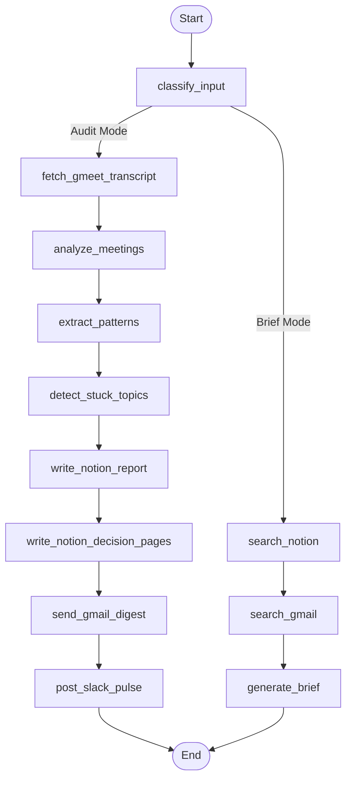

# MeetLoop — Technical Architecture & Data Flow

> **MeetLoop** is an autonomous cross-meeting intelligence and team audit engine built on **LangGraph**, **Swytchcode Policy Engine**, **OpenRouter**, and **FastAPI / React**.


---

## 1. High-Level System Architecture

```
[User Input / Webhook / Google Meet REST API]
                  │
                  ▼
         [React 19 + Vite Frontend]
         ("The Investigation Room")
                  │
                  │ POST /run (Audit or Brief Mode)
                  ▼
         [FastAPI Async API Gateway]
                  │
                  ▼
       [LangGraph StateGraph Engine]
                  │
                  ├─► Node 1: classify_input
                  │
  ┌───────────────┴────────────────────────────────────────┐
  │                                                        │
  ▼ [AUDIT MODE]                                           ▼ [BRIEF MODE]
Node 2: fetch_gmeet_transcript (Meet API)       Node 2: search_notion (Swytchcode)
  │                                                        │
Node 3: analyze_meetings (OpenRouter LLM)       Node 3: search_gmail (Swytchcode)
  │                                                        │
Node 4: extract_patterns                        Node 4: generate_brief (LLM)
  │                                                        │
Node 5: detect_stuck_topics                                │
  │                                                        │
  ├─► write_notion_report ────► [Swytchcode Policy Engine] ──► Notion Workspace
  ├─► write_notion_decision_pages ──► [Policy Engine] ──────► Dedicated Decision Pages
  ├─► send_gmail_digest ──────► [Policy Engine] ──────────► Manager Executive Email
  └─► post_slack_pulse ───────► [Policy Engine] ──────────► Team Slack Channel
```

---

## 2. Swytchcode Policy Engine & Governance

All external state mutations pass through Swytchcode's deterministic policy layer (`.swytchcode/policies.json` & `.swytchcode/integrations/policies.json`):

```
                                  ┌───────────────────────────┐
                                  │   Target Payload Action   │
                                  └─────────────┬─────────────┘
                                                │
                                                ▼
                         ┌───────────────────────────────────────────┐
                         │      Swytchcode Policy Ruleset Check      │
                         └──────────────────────┬────────────────────┘
                                                │
                 ┌──────────────────────────────┼──────────────────────────────┐
                 ▼                              ▼                              ▼
      [Notion Destination Check]      [Slack Destination Check]     [Gmail Recipient Check]
      - Only writes to authorized    - Only posts to approved      - Restricts outbound domain
        parent page in workspace       team channel (e.g. C0C4...)   to verified manager emails
      - Max 5 stuck topic pages      - Blocks direct DMs           - Blocks untrusted domains
                 │                              │                              │
                 └──────────────────────────────┼──────────────────────────────┘
                                                │
                                       [Policy Passed]
                                                │
                                                ▼
                                    [Execute via Swytchcode]
```

### Swytchcode Policies Enforced:
1. **`notion-writes-approved-workspace-only`**: Enforces that all generated Team Health Reports and Decision Pages are created strictly under the approved Notion workspace hierarchy (`NOTION_HEALTH_REPORT_PARENT_PAGE_ID`).
2. **`slack-pulse-approved-channel-only`**: Prevents accidental posting to general or unintended public channels; forces delivery to designated channel ID (`SLACK_CHANNEL_ID`).
3. **`manager-digest-domain-check`**: Validates manager digest destination to prevent internal meeting leaks.
4. **`top-5-stuck-topics-limit`**: Rate-limits and caps page creations to the top 5 high-impact circular blockers.

---

## 3. LangGraph State Machine Specification

The agent lifecycle is orchestrated through a typed LangGraph StateGraph (`backend/agent/graph.py`):



### Core State Schema (`AgentState`):
- `raw_meeting_notes`: List of unstructured meeting transcripts.
- `gmeet_meeting_code`: Google Meet conference space code.
- `meeting_summaries`: Extracted decisions, unowned tasks, and unresolved items.
- `stuck_topics`: Cross-meeting recurring items with velocity metrics.
- `commitment_load`: Percentage-based task load distribution per team member.
- `meeting_necessity_scores`: Efficiency evaluation per meeting.
- `notion_report_url`: Live URL of generated parent health report.
- `notion_decision_page_urls`: Array of live URLs for dedicated decision pages.
- `gmail_digest_sent`: Boolean verification of manager email dispatch.
- `slack_pulse_sent`: Boolean verification of Slack channel broadcast.
- `reasoning_trace`: Complete step-by-step observable trajectory.

---

## 4. Technology Stack Summary

| Component | Technology | Purpose |
|---|---|---|
| **Agent Orchestration** | LangGraph (Python) | Multi-node deterministic execution & state reduction |
| **LLM Gateway** | OpenRouter (`openrouter/free`, `nvidia/llama-3.1-nemotron-70b-instruct`) | Multi-meeting synthesis & cross-topic reasoning |
| **Integration & Policy** | Swytchcode Runtime & Policy Engine | Unified auth, tool schema enforcement, destination boundaries |
| **Google Meet Ingestion** | Google Meet REST API v2 | Live conference records & transcript chunks walker |
| **Backend Framework** | FastAPI + Uvicorn | Async REST API gateway & CORS broker |
| **Frontend Framework** | React 19 + Vite 6 + Tailwind CSS v4 | Interactive orbital studio & Investigation Room UI |
| **Animations & FX** | Framer Motion 12 + Lucide Icons + Canvas Confetti | Radial orbital laser beams & decrypted text reveals |
