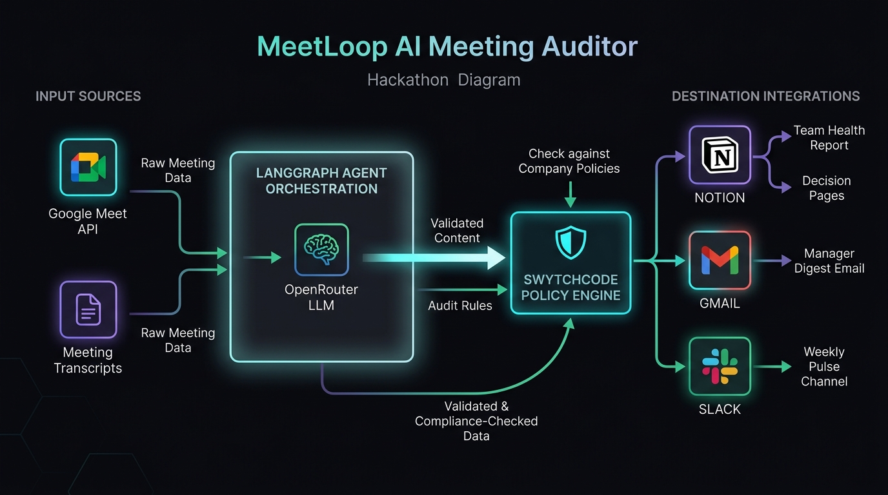

# MeetLoop — AI Meeting Auditor & Cross-Meeting Intelligence

> **Not a meeting summarizer. A meeting auditor.**  
> MeetLoop reads across *multiple* meeting transcripts at once — not within one — to uncover systemic patterns, circular dependencies, and what your calendar is hiding.



---

## 🚀 Live Demo

- **Live Application**: [https://meetloop.vercel.app](https://swytchcode-hackathon.vercel.app/) *(or local preview at `http://localhost:5173`)*
- **Interactive Swagger API Docs**: [http://localhost:8000/docs](http://localhost:8000/docs)

---

## 🔍 What MeetLoop Does

Traditional AI tools generate simple summaries for single meetings. **MeetLoop is an auditor** that detects systemic organizational dysfunction across weeks of cross-functional discussions:

1. **Stuck Topic Detection**: Identifies decisions discussed 3+ times across engineering, product, and design without reaching a resolution (e.g. *Onboarding Redesign blocked by schema migration*).
2. **Commitment Load Imbalance**: Pinpoints team members overloaded with unowned or cross-dependency action items (e.g. *Daniel holding 43% of all cross-functional blockers*).
3. **Meeting Necessity Scoring**: Evaluates whether recurring meetings actually resolve action items or create circular loops.
4. **Governed Multi-Channel Execution**:
   - 📄 **Notion Team Health Report**: Generates an overarching executive report with stuck topics and commitment distribution.
   - 📑 **Dedicated Notion Decision Pages**: Creates structured resolution workspaces for each unresolved blocker.
   - ✉️ **Gmail Manager Digest**: Sends an executive email briefing the engineering manager on team bottlenecks.
   - 💬 **Slack Weekly Pulse**: Broadcasts a crisp team pulse to the designated channel.
5. **Pre-Meeting Brief Mode**: Ask MeetLoop any topic before heading into a meeting to retrieve past context and decisions in 30 seconds.

---

## 🛡️ Swytchcode Policy Engine & Governance

MeetLoop uses **3 Swytchcode APIs**, meaningfully chained and governed by Swytchcode's deterministic policy layer:

```
[LangGraph Agent Core]
          │
          ▼
┌─────────────────────────────────────────────────────────────┐
│                 SWYTCHCODE POLICY ENGINE                    │
│                                                             │
│  ✓ Notion Workspace Boundary Check (Approved Parent Page)   │
│  ✓ Slack Pulse Channel Boundary Check (Designated Channel)  │
│  ✓ Gmail Manager Digest Domain Verification                 │
│  ✓ Top-5 Stuck Topic Threshold & Rate Limiter               │
└──────────────────────────────┬──────────────────────────────┘
                               │
       ┌───────────────────────┼───────────────────────┐
       ▼                       ▼                       ▼
[Notion API]             [Gmail API]             [Slack API]
• Team Health Report     • Manager Digest Email  • Channel Pulse
• Decision Pages
```

- **Notion Integration**: All reports and decision pages are restricted to the verified parent workspace (`NOTION_HEALTH_REPORT_PARENT_PAGE_ID`).
- **Slack Integration**: Prevents broad spam by restricting team pulses strictly to approved channels (`SLACK_CHANNEL_ID`).
- **Gmail Integration**: Restricts outbound executive digests to verified manager domains.
- **Top-5 Stuck Limit Policy**: Caps page creation to the top 5 highest-friction items to prevent notification overload.

---

## 🏗️ Tech Stack

| Layer | Technology |
|---|---|
| **Agent Framework** | LangGraph (Python 3.10+) |
| **LLM Gateway** | OpenRouter (`openrouter/free`, `nvidia/llama-3.1-nemotron-70b-instruct`) |
| **Integrations & Governance** | Swytchcode CLI, Swytchcode Runtime, Swytchcode Policy Engine |
| **Transcript Ingestion** | Google Meet REST API v2 + Synthetic PulseBoard Generator |
| **Backend Gateway** | FastAPI, Uvicorn, Pydantic v2, Python-Dotenv |
| **Frontend ("The Investigation Room")** | React 19, Vite 6, Tailwind CSS v4, Framer Motion 12 |
| **Visual Effects** | Custom Orbital Stage Engine, Lucide Icons, Canvas Confetti |

---

## 📁 Repository Structure

```
meetloop/
├── backend/
│   ├── agent/                 # LangGraph StateGraph, nodes, and LLM orchestration
│   ├── api/                   # FastAPI routes, schemas, and entry point
│   ├── observability/         # Execution trace collectors
│   ├── tests/                 # End-to-end integration & policy verification test suites
│   ├── tools/                 # Swytchcode wrappers (Notion, Gmail, Slack, Google Meet)
│   ├── .env.example           # Backend environment template
│   ├── Procfile               # Deployment runtime command for Render / Railway
│   └── requirements.txt       # Production Python dependencies
├── frontend/
│   ├── src/
│   │   ├── api/               # Unified API client (local proxy + production backend)
│   │   ├── components/        # LandingHero, StudioInput, StudioProcess, StudioResults
│   │   ├── App.jsx            # State machine & transition controller
│   │   └── index.css          # Design system & dark mode aesthetics
│   ├── .env.example           # Frontend environment template
│   ├── package.json           # React dependencies
│   ├── vercel.json            # Vercel deployment configuration
│   └── vite.config.js         # Vite configuration with Tailwind CSS v4 plugin
├── .swytchcode/
│   ├── integrations/policies.json # Destination boundary rules
│   └── policies.json              # Top-level governance ruleset
├── docs/
│   └── architecture.png       # High-resolution technical architecture diagram
├── .gitignore                 # Strict secrets and build artifact exclusions
├── ARCHITECTURE.md            # Deep-dive data-flow & state transition trace
├── SETUP.md                   # 10-minute local installation guide
└── README.md                  # Project overview & documentation
```

---

## ⚡ Quick Start

```bash
# 1. Clone repo
git clone https://github.com/yourusername/meetloop.git
cd meetloop

# 2. Setup Backend
cd backend
python -m venv venv
source venv/bin/activate # Windows: .\venv\Scripts\Activate.ps1
pip install -r requirements.txt
cp .env.example .env     # Add your API keys to .env
uvicorn api.main:app --reload

# 3. Setup Frontend
cd ../frontend
npm install
npm run dev
```

Visit **`http://localhost:5173`** to test the live orbital runner.

For full setup instructions, see [SETUP.md](SETUP.md).  
For detailed architectural traces, see [ARCHITECTURE.md](ARCHITECTURE.md).

---

## 🏆 Hackathon Track

- **Event**: Swytchcode Buildathon
- **Track**: AI Meeting and Productivity Agent
